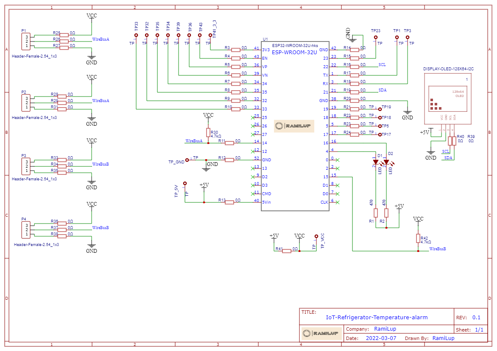

# IoT-based refrigerator alarm system with real time Telegram notifications

  
  

## Main goal:
It happened twice last summer: the refrigerator door was not closed properly.
Both instances occurred on weekends when we were away from home. 
Upon our return, we discovered that All dairy and meat items have spoiled and need to be discarded. 
Although the refrigerator did alert locally, no one could heard it, 
even when we were at home before leaving for vacation. This led me to ponder a 
reliable and effective solution.

Developing a temperature sensor with a real-time alarm that can be used
in home refrigerators and in similar systems to monitor the temperature and to prevent
food spoilage and ensure food safety. 

The common cause of the internal temperature of the refrigerator to rise is leaving the refrigerator door open. 
However, there are other reasons why the contents of the refrigerator may be damaged after a few hours without cooling. 
For example, long power outage,  the refrigerator compressor has stoped working, or the controller may malfunction. 
In these cases, even though they are rare, the contents of the refrigerator will be damaged.

## Cost effective ?
The components cost for this current initial version is less than $12 USD and it is based on the ESP32 Wroom module on a prototype board.

On the other hand the newer updated version, which is currently in the development stage, includes a costume made 2/4-layers PCB, ESP32 
module with a backup battery and an internal GSM modem, and the total cost is about $18 USD.

|Value |      Current Version           |       New Version |
:--------|:------------------------------:|:-------------------------:
|Board     | Prototype                      | 2/4-layer pcb |
|Display |OLED 1.3"                             | OLED 1.3"|
|External temperature Sensors|2     | 2     |
|internal sensor  |1              | 1   |
|Power| external DC                     | External DC with backup battery |
|Communication | Wifi                            | Wifi + GPRS |
|Patrs cost  | 12$USD          | 18$USD |

Taking into account the cost of the project's parts (~20$USD) versus the cost of the food in the refrigerator (+200$USD), it is clear that this Alarm project is economically viable.

Furthermore, one of the main advantages of this project is that few units can work simultaneously with the same Telegram channel. Each unit is independent and this project can also be used for temperature monitoring of few refrigerators or freezers, refrigeration rooms,  warehouses, returning air in conditioning systems, etc.

### PCB:
For the first prototype board, I used a standard "Universal Breadboard Prototyping FR4". 
The new and updated version (both hardware and software) will use an improved manufactured PCB version,  
which I am currently designing online at https://easyeda.com/  
This site supports both drawing the electrical schematic and converting it to a PCB. 
In other projects I have worked on, I have found that it is very convenient to manufacture the PCBs directly  
from the easyeda.com, which automatically sends all the needed files to https://jlcpcb.com/ 
(For example, 5 pcbs, 2-layers , FR4, at the size of  65mm x 95mm, should cost less then 10$USD.) 

 

[The electrical schematic and PCB design are available here](pcb-design/)

 

  
    

Click the following schematic image for a full-size view. This is the newer version, which is based on the prototype version. 

  

## Main Projects features:
I have implemented few features in this project, here are the main ones: 
- Monitoring three temperature sensors simultaneously (Two sealed external metal case sensors for  temperature control in the refrigerator/freezer and one internal sensor inside the Arduino case). 
- Alerts:  
  - Sending a text message to the telegram channel with the alarm details. 
  - Blinking LED continuously as long as any alarm is active. 
- Changing definitions, code values and settings using both telegram and a serial port: 
i.e. defining alert temperature range, setting telegram bot parameters, getting current status, wifi network settings... 

## Remarks: 
- According to the manufacturer's specifications the temperature sensor is effective for measurement range of 55°C to +125°C. 
- This project is also not meant for life-saving systems 
-  For the thermal tests I have used the the FLIR thermal camera FLIRONE PRO for android.

## Part List: 
- 5x 10kohm resistors 
- 2x ds1820 (stainless steel package, waterproof) 
- 1x ds1820 (plastic case, TO-92) 
- 1.3", I2C , 128x64 Oled display 
- ESP32 wroom 32U with external Wifi ant. 
- External Wifi ant. 
- 2x 3 pins female+male connector for temperature sensors 
- 1x 4 pins female connector for oled display 
- mini usb data cable 
- PCB 
 

## Thermal Test:

I used my FLIR One Android cam for the thermal testing to identify areas of 
heat loss and potential problems in my project. 

## Starting the project:
The existing refrigerator alarm emits only a weak sound which will only be relevant in the case that someone is nearby to notice it. 
More than that, in all other kinds of a failures in the refrigerator, it will not emit the local sound alarm.

If the temperature exceeds the normal limits (non stop cooling is also a fault), an alert is sent to the
Telegram channel, and the case alarm light will start flashing.

This project seems to have a straightforward coding process, but I have found out that there are 
two other challenges in this project which I'll provide more information on them in the next section:
  - Does the location of the sensor in the refrigerator matter? (spoiler - Yes, it does)
  - How to install sensors in a refrigerator without damaging or compromising the seal and letting cold air escape?

The above questions can be answered by the few thermal experiments I conducted. I will elaborate on this in the next paragraph.

 

## Main challenges:
### Using the refrigerator's door sensor ?
At the beginning, I thought there was an elegant and easy solution to implement.
I had an idea to directly connect to the refrigerator's door sensor or controller, but this easy solution has some disadvantages:
- It will not be effective in cases where the refrigerator is not working because there is no electricity.
- The door sensor isn't very accurate (I have noticed that sometimes the door isn't completely closed, and the sensor doesn't detect it)
- The temperature in the refrigerator might not be in the correct range even when the door is closed. 

**Conclusions:**
I decided to go with a solution that uses an external, independent sensor.

### Choosing a remote controling and alert messages technologies: 
Seeking for a reliable and efficient communication technology that does not require any maintenance and will allow me to: 
- Send alarm messages. 
- Send configure commands. 
- Be easy to use and well-documented for the Arduino environment 
- Be reliable, with a proven track record of uptime. 
- Support multiple users and systems simultaneously. 

The technologies I have considered were: 
- Push notifications via an Android app 
- Cellulare SMS 
- Signal, Telegram, WhatsApp, messanger 
 

**Conclusions:**

After a number of tests and trials, I understood that Telegram can provides a complete answer
to all the requirements and will allow the addition of new features in the future.
 

### Sensors location:
An integral part of the development is to find the best location for the temperature sensors.
After conducting several thermal tests and experiments, I concluded that the location of sensors inside the refrigerator has a major
impact on the system's reliability and the reduction of false alarms.  

**Conclusions:**

- Before setting the correct place for the sensor, there are a few important parameters that need to be taken into account:
  - The sensor has a response time.
  - When the door is opened for a short time or left open, it brings in warm air at room temperature.
  - Outside to the refrigerator, the environment temperature is about 23°C.
  - Inside the refrigerator the temperature is about 4°C.
  - The inside of the refrigerator heats up slowly even when the door is widely opened.
  - There are significant temperature differences in the refrigerator between the inside of the shelf and the far end near the door (up to 4°C).
  - The glass shelf which has accumulated enough cold is effecting the temperature sensor even when the door is open.

  
    

 ### Sensors wiring:
I conducted an experiment to test the implications of inserting a temperature sensor into a refrigerator 
through the door without drilling into the refrigerator wall.

The result of the experiment is that cold air escapes from the refrigerator at the point of contact 
between the rubber gasket and the temperature sensor (see photo). This also suggests that hot and humid air is entering at the same time.

**Conclusions:**
- For experiments and short periods of time, it is possible to insert sensors into the refrigerator through the 
door, with the rubber seal closing over them (see photo), but in the long term this is not an efficient solution.
- To prevent the escape of cold air at the point of contact between the door gasket and the sensor wire, 
it is necessary to use as thin a wire as possible. Therefore, I tested a flat wire (0.33 mm thick! This
type of wire is originally used for speakers).
- The use of flat 0.33 mm thick wire does not damage the seal of the refrigerator door (see photo).

  

After I've done the thermal tests, in which I have tested the temperature in different locations, I came up with the conclusion
where it is recommended to place the sensors:

- At a distance of at least 2-3 centimeters from a glass shelf
- At a distance of at least 4 cm away from the cold air outlet.
- It should not touch any object in the refrigerator.

### Packaging and display:
These versions use a standard plastic housing 50mmX10mmX20mm with 0.1 inches (2.54 mm) 4 and 3 pins connectors suitable for the two 
external sensors, and oled display.

## The code:
Before verifing or compiling the Sketch you must read the source code Disclaimer.
I wrote the code quickly to test the feasibility of my idea. and currently I'm working on a more advanced version,
which will take me some time as I'm adding functions, designing a new PCB, and a new plastic housing. 

[The Arduino source code can be found here](arduino/)
 

## The final result:
 

https://github.com/RamiLup/IoT-Refrigerator-Temperature-alarm-prototype/assets/42478562/3e619a1a-87c1-48c1-9973-3554a3a2b072

 

